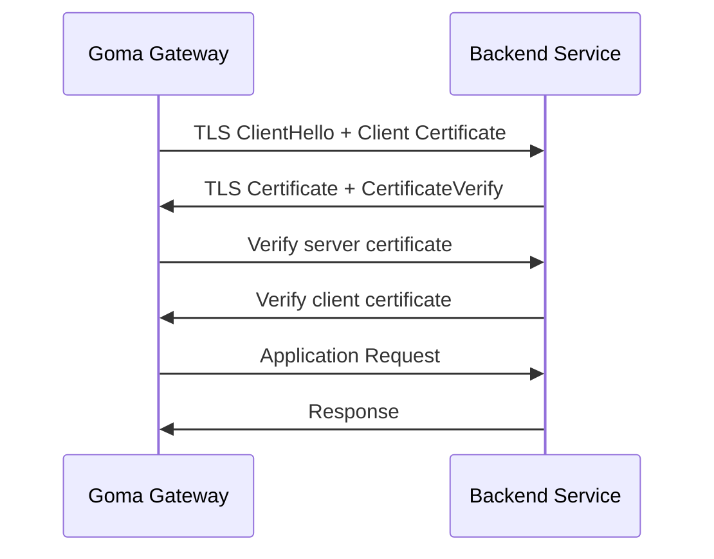
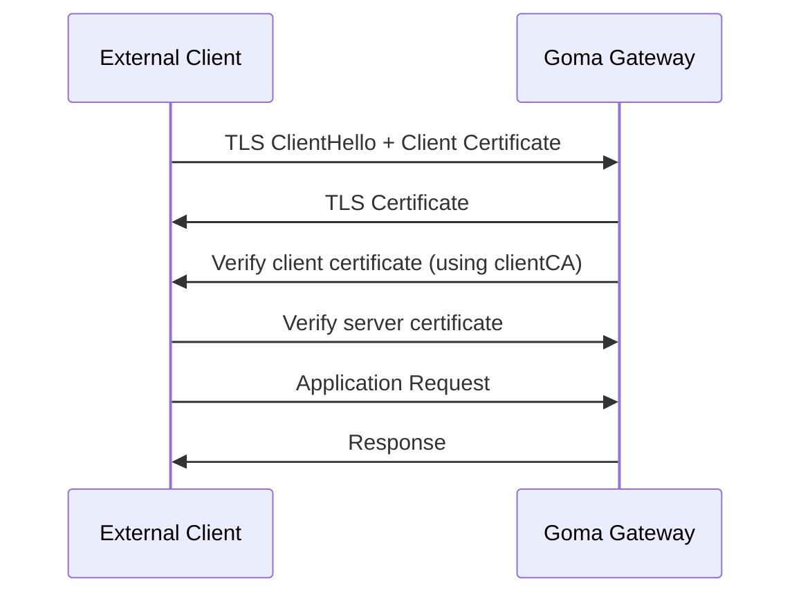
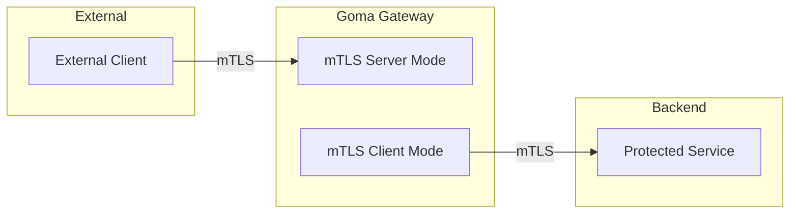

# Mutual TLS (mTLS)

Goma Gateway supports **Mutual TLS (mTLS)** for both **outbound connections to backend services** and **inbound connections from external clients**.

mTLS enforces **two-way certificate validation**, ensuring both parties cryptographically authenticate each other before exchanging application data.

---

## 1. Backend mTLS (Gateway as Client)

When forwarding requests to upstream services, Goma Gateway can operate as a **TLS client** establishing an mTLS connection to backend servers.

### TLS Handshake Overview



During this exchange, the gateway:

* Validates the backend’s certificate (**server authentication**)
* Presents its own client certificate (**client authentication**)

This ensures only trusted gateways can communicate with secured backend services.

---

## 2. Client mTLS (Gateway as Server)

Goma Gateway can also accept inbound connections from external clients over mTLS, requiring them to present trusted certificates.

### TLS Handshake Overview



### Configuration Example

```yaml
gateway:
  tls:
    certificates:
      - cert: /etc/goma/certs/cert.pem
        key: /etc/goma/certs/key.pem
    clientAuth:
      clientCA:  /etc/goma/certs/ca.pem
      required: true
```

When `required: true` is set, the gateway will reject connections unless the client certificate is signed by a trusted CA.

### Flow Summary

1. Client authenticates the gateway
2. Gateway authenticates the client
3. Traffic proceeds only if both validations succeed

---

## Architecture Overview



---

## How Mutual TLS Works?

Standard TLS provides **server-side authentication only** — Goma Gateway verifies the backend certificate.

With **Mutual TLS**, authentication becomes **bidirectional**:

```
Client → verifies → Server certificate
Server → verifies → Client certificate
```

Benefits include:

* Strong identity enforcement
* Zero-trust compatible service communication
* Reduced surface for unauthorized access

---

## Backend Configuration

mTLS can be enabled per-backend through the `security.tls` section of each route.

| Field                | Required | Description                                                                            |
|----------------------|----------|----------------------------------------------------------------------------------------|
| `rootCAs`            | Yes      | CA certificate used to validate backend certificates. Supports path, PEM, or base64.   |
| `clientCert`         | Yes      | Client certificate presented by the gateway. Supports path, PEM, or base64.            |
| `clientKey`          | Yes      | Private key corresponding to `clientCert`. Supports path, PEM, or base64.              |
| `insecureSkipVerify` | No       | Disables certificate verification. Default: `false`. Use only for development/testing. |

> **Note:** All certificate fields (`rootCAs`, `clientCert`, `clientKey`) accept:
>
> * File paths
> * Raw PEM content
> * Base64-encoded PEM

---

## Example: Backend mTLS Routing

```yaml
routes:
  - name: api
    path: /
    hosts:
      - api.example.com
    enabled: true
    backends:
      - endpoint: https://api-example:8443
        weight: 80
      - endpoint: https://api-example-beta:8443
        weight: 20
    security:
      tls:
        insecureSkipVerify: false
        rootCAs: /etc/goma/certs/ca.pem
        clientCert: /etc/goma/certs/cert.pem
        clientKey: /etc/goma/certs/key.pem
    healthCheck:
      path: /
      interval: 15s
      timeout: 10s
      healthyStatuses: [200]
```


