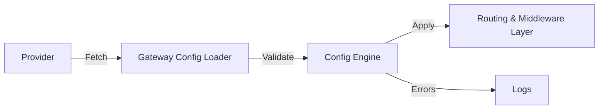

# Providers

Providers in **Goma Gateway** allow you to dynamically load routes, and middlewares from internal or external sources.

They support configuration-driven workflows, GitOps, and centralized control planes.

Supported providers:

* **File**
* **HTTP**
* **Git**

---

# Architecture Overview

### Provider-driven config update cycle




# File Provider

Loads configuration from a local directory with optional filesystem watch.

### Configuration Reference

| Field       | Type   | Required | Description                              |
|-------------|--------|----------|------------------------------------------|
| `enabled`   | bool   | Yes      | Enables the provider                     |
| `directory` | string | Yes      | Directory containing configuration files |
| `watch`     | bool   | No       | Enables automatic reload on file change  |

### Example

```yaml
gateway:
  providers:
    file:
      enabled: true
      directory: /etc/goma/providers
      watch: true
```

---

# HTTP Provider

Fetches configuration from an HTTP endpoint. Useful for centralized config services.

Supports retry logic, TLS settings, caching, and custom headers.

### Supported Content Types

* `application/json`
* `application/yaml`
* `application/x-yaml`
* `text/yaml`

### Configuration Reference

| Field                | Type     | Required | Default                     | Description              |
|----------------------|----------|----------|-----------------------------|--------------------------|
| `enabled`            | bool     | Yes      | —                           | Enables the provider     |
| `endpoint`           | string   | Yes      | —                           | Remote configuration URL |
| `interval`           | duration | No       | 60s                         | Polling interval         |
| `timeout`            | duration | No       | 10s                         | Request timeout          |
| `retryAttempts`      | int      | No       | 3                           | Max retry attempts       |
| `retryDelay`         | duration | No       | 2s                          | Delay between retries    |
| `cacheEnabled`       | bool     | No       | true                        | Enables local caching    |
| `cacheDir`           | string   | No       | /tmp/goma/cache/config.json | Cache file path          |
| `insecureSkipVerify` | bool     | No       | false                       | Skip TLS verification    |
| `headers`            | map      | No       | —                           | Custom HTTP headers      |

### Example

```yaml
gateway:
  providers:
    http:
      enabled: true
      endpoint: "https://config.example.com/api/gateway/config"
      interval: 60s
      timeout: 10s
      retryAttempts: 3
      retryDelay: 2s
      cacheEnabled: true
      cacheDir: "/tmp/goma/cache/config.json"
      insecureSkipVerify: false
      headers:
        X-Gateway-ID: "goma-prod-01"
        Authorization: "${GOMA_AUTHORIZATION}"
```

---

# Git Provider

Fetches configuration from a Git repo. Ideal for GitOps setups.

### Supports Authentication Types

| Type  | Credentials         |
|-------|---------------------|
| token | token               |
| basic | username + password |
| ssh   | private SSH key     |

### Configuration Reference

| Field      | Type     | Required | Default | Description                        |
|------------|----------|----------|---------|------------------------------------|
| `enabled`  | bool     | Yes      | —       | Enables the provider               |
| `url`      | string   | Yes      | —       | Git repository URL                 |
| `branch`   | string   | No       | main    | Git branch to pull                 |
| `path`     | string   | No       | /       | Subpath containing gateway configs |
| `interval` | duration | No       | 60s     | Poll interval                      |
| `cloneDir` | string   | No       | temp    | Local clone directory              |
| `auth`     | object   | No       | —       | Auth configuration                 |

### Auth Sub-Fields

| Field        | Type   | Required  | Used For | Description                |
|--------------|--------|-----------|----------|----------------------------|
| `type`       | string | Yes       | all      | `token`, `basic`, `ssh`    |
| `token`      | string | for token | token    | Git token auth             |
| `username`   | string | for basic | basic    | Username for basic auth    |
| `password`   | string | for basic | basic    | Password for basic auth    |
| `sshKeyPath` | string | for ssh   | ssh      | Path to SSH private key    |
| `sshKeyData` | string | for ssh   | ssh      | Base64 encoded private key |

### Example

```yaml
gateway:
  providers:
    git:
      enabled: true
      url: "https://github.com/jkaninda/goma-gateway-production-deployment.git"
      branch: "main"
      path: /gateway/extra
      interval: 60s
      auth:
        type: token # token | basic | ssh
        token: ${GIT_TOKEN}
        username: ${GIT_USER_NAME}
        password: ${GIT_PASSWORD}
        sshKeyPath: /etc/goma/ssh/key
        sshKeyData: ${GIT_SSH_KEY_DATA}
      cloneDir: ""
```


