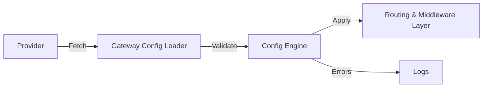
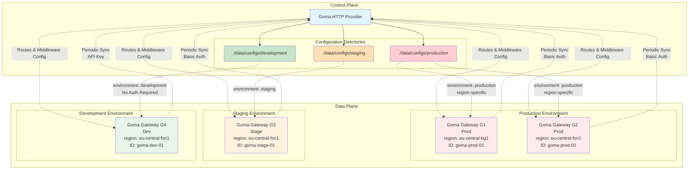

# Providers

Providers in **Goma Gateway** allow you to dynamically load routes, and middlewares from internal or external sources.

They support configuration-driven workflows, GitOps, and centralized control planes.

Supported providers:

* **File**
* **HTTP**
* **Git**

---

# Architecture Overview

### Provider-driven config update cycle




# File Provider

Loads configuration from a local directory with optional filesystem watch.

### Configuration Reference

| Field       | Type   | Required | Description                              |
|-------------|--------|----------|------------------------------------------|
| `enabled`   | bool   | Yes      | Enables the provider                     |
| `directory` | string | Yes      | Directory containing configuration files |
| `watch`     | bool   | No       | Enables automatic reload on file change  |

### Example

```yaml
gateway:
  providers:
    file:
      enabled: true
      directory: /etc/goma/providers
      watch: true
```

---

# HTTP Provider

Fetches configuration from an HTTP endpoint. Useful for centralized config services.

Supports retry logic, TLS settings, caching, and custom headers.

### Supported Content Types

* `application/json`
* `application/yaml`
* `application/x-yaml`
* `text/yaml`

### Configuration Reference

| Field                | Type     | Required | Default                     | Description              |
|----------------------|----------|----------|-----------------------------|--------------------------|
| `enabled`            | bool     | Yes      | —                           | Enables the provider     |
| `endpoint`           | string   | Yes      | —                           | Remote configuration URL |
| `interval`           | duration | No       | 60s                         | Polling interval         |
| `timeout`            | duration | No       | 10s                         | Request timeout          |
| `retryAttempts`      | int      | No       | 3                           | Max retry attempts       |
| `retryDelay`         | duration | No       | 2s                          | Delay between retries    |
| `cacheDir`           | string   | No       | /tmp/goma/cache/config.json | Cache file path          |
| `insecureSkipVerify` | bool     | No       | false                       | Skip TLS verification    |
| `headers`            | map      | No       | —                           | Custom HTTP headers      |

### Example

```yaml
gateway:
  providers:
    http:
      enabled: true
      endpoint: "https://config.example.com/api/gateway/config"
      interval: 60s
      timeout: 10s
      retryAttempts: 3
      retryDelay: 2s
      # Yaml or JSON caching
      cacheDir: "" # Default /tmp/goma/cache/config.json # Yaml or JSON caching
      insecureSkipVerify: false
      headers:
        X-Goma-Meta-Gateway-Id: "goma-prod-01"
        X-Goma-Meta-Environment: "production"
        Authorization: "${GOMA_AUTHORIZATION}"
```
### Response Example

The remote endpoint should return the goma configuration in YAML or JSON format. Example response:

```yaml
version: "1" # Your config version
timestamp: 2024-10-01T12:00:00Z # Optional timestamp
checksum: "536ce8ecab0308f003fbabcb33ca87a9badd857b6bcba5c101a5131b0f65da2f" # Optional checksum for integrity
metadata:
  # Optional metadata about the config
  gateway-id: goma-prod-01
  environment: production
routes:
  - name: api-example
    path: /
    target: http://api-example:8080
    middlewares: ["rate-limit","basic-auth"]
  - name: host-example
    path: /api
    rewrite: /
    hosts:
      - api.example.com
    backends:
      - endpoint: https://api-1.example.com
        weight: 20
      - endpoint: https://api-2.example.com
        weight: 80
    healthCheck:
      path: /
      interval: 30s
      timeout: 10s
middlewares:
  - name: rate-limit
    type: rateLimit
    rule:
      unit: minute
      requestsPerUnit: 20
      banAfter: 5
      banDuration: 5m
  - name: basic-auth
    type: basicAuth
    paths: ["/admin","/docs","/openapi"]
    rule:
      realm: Restricted
      forwardUsername: true
      users:
        - username: admin
          password: $2y$05$TIx7l8sJWvMFXw4n0GbkQuOhemPQOormacQC4W1p28TOVzJtx.XpO # bcrypt hash for 'admin'
        - username: user
          password: password
```
      
---

# Git Provider

Fetches configuration from a Git repo. Ideal for GitOps setups.

### Supports Authentication Types

| Type  | Credentials         |
|-------|---------------------|
| token | token               |
| basic | username + password |
| ssh   | private SSH key     |

### Configuration Reference

| Field      | Type     | Required | Default | Description                        |
|------------|----------|----------|---------|------------------------------------|
| `enabled`  | bool     | Yes      | —       | Enables the provider               |
| `url`      | string   | Yes      | —       | Git repository URL                 |
| `branch`   | string   | No       | main    | Git branch to pull                 |
| `path`     | string   | No       | /       | Subpath containing gateway configs |
| `interval` | duration | No       | 60s     | Poll interval                      |
| `cloneDir` | string   | No       | temp    | Local clone directory              |
| `auth`     | object   | No       | —       | Auth configuration                 |

### Auth Sub-Fields

| Field        | Type   | Required  | Used For | Description                |
|--------------|--------|-----------|----------|----------------------------|
| `type`       | string | Yes       | all      | `token`, `basic`, `ssh`    |
| `token`      | string | for token | token    | Git token auth             |
| `username`   | string | for basic | basic    | Username for basic auth    |
| `password`   | string | for basic | basic    | Password for basic auth    |
| `sshKeyPath` | string | for ssh   | ssh      | Path to SSH private key    |
| `sshKeyData` | string | for ssh   | ssh      | Base64 encoded private key |

### Example

```yaml
gateway:
  providers:
    git:
      enabled: true
      url: "https://github.com/jkaninda/goma-gateway-production-deployment.git"
      branch: "main"
      path: /gateway/extra
      interval: 60s
      auth:
        type: token # token | basic | ssh
        token: ${GIT_TOKEN}
        username: ${GIT_USER_NAME}
        password: ${GIT_PASSWORD}
        sshKeyPath: /etc/goma/ssh/key
        sshKeyData: ${GIT_SSH_KEY_DATA}
      cloneDir: ""
```

## Discover Goma HTTP Provider

The **Goma HTTP Provider** is a centralized configuration service designed for **Goma Gateway** deployments. It allows multiple gateway instances to dynamically fetch their configuration over HTTP, based on **authentication** and **request metadata**.

By separating configuration delivery from gateway runtime, Goma HTTP Provider makes it easy to manage **environment-specific** configurations (production, staging, development, etc.) from a single control plane.

### What It Does

* Serves Goma Gateway configurations from multiple directories
* Selects the correct configuration using request metadata (headers)
* Supports secure access via multiple authentication mechanisms
* Enables dynamic, environment-aware configuration delivery
* Works seamlessly with containerized and cloud-native setups


## Architecture Overview

The diagram below illustrates how **Goma HTTP Provider** acts as a control plane, serving configurations to multiple **Goma Gateway** instances across different environments.




## Supported Authentication Methods

Goma HTTP Provider supports flexible access control using one or more of the following:

* **API Key**
* **Basic Authentication**
* **Request metadata headers**

Authentication and metadata checks can be combined to ensure that only authorized gateways can retrieve the correct configuration for their environment.


## Useful Links

* **Source Code**:
  [https://github.com/jkaninda/goma-http-provider](https://github.com/jkaninda/goma-http-provider)

* **Docker Image**:
  [https://hub.docker.com/r/jkaninda/goma-http-provider](https://hub.docker.com/r/jkaninda/goma-http-provider)


