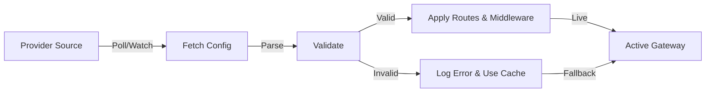

# Providers

Providers in **Goma Gateway** enable dynamic configuration management by automatically discovering and loading routes and middlewares from various sources. This eliminates manual configuration updates and enables modern deployment patterns like GitOps, container orchestration, and centralized configuration management.

## Why Use Providers?

- **Dynamic Discovery**: Automatically detect and configure services without manual intervention
- **GitOps Integration**: Manage gateway configuration as code in version control
- **Centralized Management**: Control multiple gateways from a single source
- **Zero Downtime Updates**: Apply configuration changes without restarts

## Available Providers

Goma Gateway supports both **built-in** and **external** providers:

**Built-in Providers:**
- **File** - Load from local filesystem with hot-reload
- **HTTP** - Fetch from remote API endpoints
- **Git** - Pull from Git repositories (GitOps)

**External Providers:**
- **Docker/Swarm** - Auto-configure from container labels
- **Kubernetes** - Generate config from CRDs and annotations
- **HTTP API** - RESTful configuration management


## How Providers Work

Providers follow a continuous sync cycle:



**Key behaviors:**
- Validation failures don't crash the gateway, previous valid config remains active
- HTTP/Git providers cache the last successful config for resilience
- File provider supports live reload via filesystem watching


# File Provider

Loads configuration from a local directory with optional filesystem watch.

### Configuration Reference

| Field       | Type   | Required | Description                              |
|-------------|--------|----------|------------------------------------------|
| `enabled`   | bool   | Yes      | Enables the provider                     |
| `directory` | string | Yes      | Directory containing configuration files |
| `watch`     | bool   | No       | Enables automatic reload on file change  |

### Example

```yaml
gateway:
  providers:
    file:
      enabled: true
      directory: /etc/goma/providers
      watch: true
```

---

# HTTP Provider

Fetches configuration from an HTTP endpoint. Useful for centralized config services.

Supports retry logic, TLS settings, caching, and custom headers.

### Supported Content Types

* `application/json`
* `application/yaml`
* `application/x-yaml`
* `text/yaml`

### Configuration Reference

| Field                | Type     | Required | Default                     | Description              |
|----------------------|----------|----------|-----------------------------|--------------------------|
| `enabled`            | bool     | Yes      | —                           | Enables the provider     |
| `endpoint`           | string   | Yes      | —                           | Remote configuration URL |
| `interval`           | duration | No       | 60s                         | Polling interval         |
| `timeout`            | duration | No       | 10s                         | Request timeout          |
| `retryAttempts`      | int      | No       | 3                           | Max retry attempts       |
| `retryDelay`         | duration | No       | 2s                          | Delay between retries    |
| `cacheDir`           | string   | No       | /tmp/goma/cache/config.json | Cache file path          |
| `insecureSkipVerify` | bool     | No       | false                       | Skip TLS verification    |
| `headers`            | map      | No       | —                           | Custom HTTP headers      |

### Example

```yaml
gateway:
  providers:
    http:
      enabled: true
      endpoint: "https://config.example.com/api/gateway/config"
      interval: 60s
      timeout: 10s
      retryAttempts: 3
      retryDelay: 2s
      # Yaml or JSON caching
      cacheDir: "" # Default /tmp/goma/cache/config.json # Yaml or JSON caching
      insecureSkipVerify: false
      headers:
        X-Goma-Meta-Gateway-Id: "goma-prod-01"
        X-Goma-Meta-Environment: "production"
        Authorization: "${GOMA_AUTHORIZATION}"
```
### Response Example

The remote endpoint should return the goma configuration in YAML or JSON format. Example response:

```yaml
version: "1" # Your config version
timestamp: 2024-10-01T12:00:00Z # Optional timestamp
checksum: "536ce8ecab0308f003fbabcb33ca87a9badd857b6bcba5c101a5131b0f65da2f" # Optional checksum for integrity
metadata:
  # Optional metadata about the config
  gateway-id: goma-prod-01
  environment: production
routes:
  - name: api-example
    path: /
    target: http://api-example:8080
    middlewares: ["rate-limit","basic-auth"]
  - name: host-example
    path: /api
    rewrite: /
    hosts:
      - api.example.com
    backends:
      - endpoint: https://api-1.example.com
        weight: 20
      - endpoint: https://api-2.example.com
        weight: 80
    healthCheck:
      path: /
      interval: 30s
      timeout: 10s
middlewares:
  - name: rate-limit
    type: rateLimit
    rule:
      unit: minute
      requestsPerUnit: 20
      banAfter: 5
      banDuration: 5m
  - name: basic-auth
    type: basicAuth
    paths: ["/admin","/docs","/openapi"]
    rule:
      realm: Restricted
      forwardUsername: true
      users:
        - username: admin
          password: $2y$05$TIx7l8sJWvMFXw4n0GbkQuOhemPQOormacQC4W1p28TOVzJtx.XpO # bcrypt hash for 'admin'
        - username: user
          password: password
```
      
---

# Git Provider

Fetches configuration from a Git repo. Ideal for GitOps setups.

### Supports Authentication Types

| Type  | Credentials         |
|-------|---------------------|
| token | token               |
| basic | username + password |
| ssh   | private SSH key     |

### Configuration Reference

| Field      | Type     | Required | Default | Description                        |
|------------|----------|----------|---------|------------------------------------|
| `enabled`  | bool     | Yes      | —       | Enables the provider               |
| `url`      | string   | Yes      | —       | Git repository URL                 |
| `branch`   | string   | No       | main    | Git branch to pull                 |
| `path`     | string   | No       | /       | Subpath containing gateway configs |
| `interval` | duration | No       | 60s     | Poll interval                      |
| `cloneDir` | string   | No       | temp    | Local clone directory              |
| `auth`     | object   | No       | —       | Auth configuration                 |

### Auth Sub-Fields

| Field        | Type   | Required  | Used For | Description                |
|--------------|--------|-----------|----------|----------------------------|
| `type`       | string | Yes       | all      | `token`, `basic`, `ssh`    |
| `token`      | string | for token | token    | Git token auth             |
| `username`   | string | for basic | basic    | Username for basic auth    |
| `password`   | string | for basic | basic    | Password for basic auth    |
| `sshKeyPath` | string | for ssh   | ssh      | Path to SSH private key    |
| `sshKeyData` | string | for ssh   | ssh      | Base64 encoded private key |

### Example

```yaml
gateway:
  providers:
    git:
      enabled: true
      url: "https://github.com/jkaninda/goma-gateway-production-deployment.git"
      branch: "main"
      path: /gateway/extra
      interval: 60s
      auth:
        type: token # token | basic | ssh
        token: ${GIT_TOKEN}
        username: ${GIT_USER_NAME}
        password: ${GIT_PASSWORD}
        sshKeyPath: /etc/goma/ssh/key
        sshKeyData: ${GIT_SSH_KEY_DATA}
      cloneDir: ""
```
---

## External Providers

### Docker / Swarm Provider

Goma Gateway does not include a built-in Docker provider to remain lightweight and modular.
If you deploy services using **Docker Compose** or **Docker Swarm**, the **Goma Docker Provider** automatically generates gateway configuration from container labels.

This approach will feel familiar if you’ve used **Traefik**: routing rules, services, and middleware are declared directly on containers.

👉 See:
[Goma Docker Provider](https://github.com/jkaninda/goma-docker-provider)

---

### HTTP API Provider (External)

The **Goma HTTP Provider** exposes a REST API for managing routes, middleware, and gateway configuration dynamically.

It’s ideal for:

* Control planes
* Automation workflows
* Internal platform tools

👉 See:
[Goma HTTP Provider](https://github.com/jkaninda/goma-http-provider)
